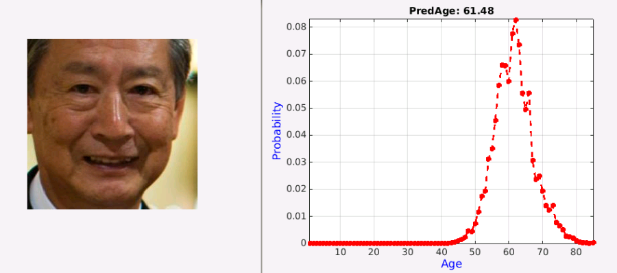
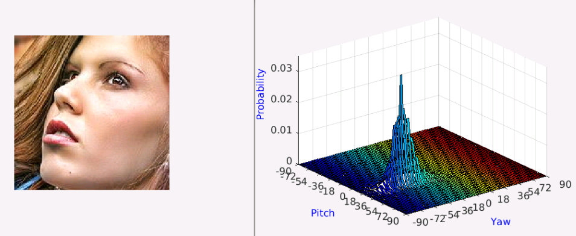

# DLDL-MatConvNet

This repository is a MatConvNet re-implementation of ["Deep Label Distribution Learning with Label Ambiguity", Bin-Bin Gao, Chao Xing, Chen-Wei Xie, Jianxin Wu, Xin Geng](https://doi.org/10.1109/TIP.2017.2689998). The paper is accepted at [IEEE Trans. Image Processing (TIP), 2017].

You can train Deep ConvNets from Scratch or a pre-trained model on your datasets with limited samples and ambiguous labels. This repo is created by [Bin-Bin Gao](http://lamda.nju.edu.cn/gaobb).


### Table of Contents
0. [Facial Age Estimation](#Facial-Age-Estimation)
0. [Head Pose Estimation](#Head-Pose-Estimation)
0. [Multi-label Classification](#Multi-label-Classification)
0. [Semantic Segmentation](#Semantic-Segmentation)

### Facial Age Estimation
step1: download [pre-trained model](https://pan.baidu.com/s/1eSKWELO) to ./DLDLModel

step2: in matlab, run age-demo.m



Pre-trained models:

| Dataset | Model | MAE | epsilon-error
| - | :- | :-:   |:-: |
| ChaLearn15 | [DLDL](https://pan.baidu.com/s/1og9A2W2i_t6OcY85gpD4tQ)          | 5.34(exp)| 0.44  |
| ChaLearn15 | [DLDL+VGG-Face](https://pan.baidu.com/s/110z8uf5w7AKuQtQIzgLX7w) | 3.51(exp)| 0.31  |
| Morph | [DLDL](https://pan.baidu.com/s/1-xoBYwHvKMdyWvrhlfnFPA)               | 2.51±0.03 (max)| -|
| Morph | [DLDL+VGG-Face](https://pan.baidu.com/s/1ofpizhzLtf6mI6Nj468xGQ)      | 2.42±0.01 (max)| -|


### Head Pose Estimation
step1: download [pre-trained model](https://pan.baidu.com/s/1jIOSuSA) to ./DLDLModel

step2: in matlab, run pose-demo.m



Pre-trained models:

| Dataset | Model |Pitch| Yaw| Pitch+Yaw| Pitch|  Yaw| Pitch+Yaw|
| - | :- |:-:|:-:|:-:|:-:|:-:|:-:|
| Pointing’04 | [DLDL](https://pan.baidu.com/s/1GWn6JLf5mws-aCDyYxBKaw)         |1.69±0.32|3.16±0.07|4.64±0.24|91.65±1.13|79.57±0.57|73.15±0.72|
| BJUT-3D |     [DLDL](https://pan.baidu.com/s/10-snJszzFvmqhbowDvHrGw) |0.02±0.01|0.07±0.01|0.09±0.01|99.81±0.04|99.27±0.08|99.09±0.09|
| AFLW |        [DLDL](https://pan.baidu.com/s/1m7XFUTSyUmATeL9WAXSsQQ)               |5.75|6.60|9.78|95.41|92.89|89.27|


### Multi-label Classification
step1: download [pre-trained model](https://pan.baidu.com/s/1kV69uxL) to ./DLDLModel

step2: in matlab, run ml-demo.m


SINGLE MODEL CLASSIFICATION MAP (IN%)ON VOC2007

|Training Style| Net-D+Max| Net-D+Avg| Net-E+Max| Net-E+Avg|
| :-: | :-: |:-:|:-:|:-:|
|IF-DLDL| 90.1 [model](https://pan.baidu.com/s/1tFoDlunq_YIjNMni7fgoEQ)| 90.5 [model](https://pan.baidu.com/s/1poqIsZUUZOni0DHmHoIgRg)| 90.6 [model](https://pan.baidu.com/s/1o9aI1MJ9hdnh7FsBWq3R1g)| 90.7 [model](https://pan.baidu.com/s/1o9aI1MJ9hdnh7FsBWq3R1g)|
|PF-DLDL| 92.3 [model](https://pan.baidu.com/s/1ghprkF4yY--ytjmKb50o-w)| 92.1 [model](https://pan.baidu.com/s/16QumzkyMMYbbXtFBFw5gKA)| 92.5 [model](https://pan.baidu.com/s/1fo2H4zrlVAA6iqQU5WAnWg)| 92.2 [model](https://pan.baidu.com/s/1fo2H4zrlVAA6iqQU5WAnWg)|

MULTI-MODEL ENSEMBLE COMPARISION (IN%) ON VOC2007 AND VOC2012

|Dataset|Training Style| mAP|
| :-: | :-: | :-: |
|VOC2007|[IF-DLDL](https://pan.baidu.com/s/1PSzVpfRGqqNQ_0B9Rqnhnw)| 91.1|
|VOC2007|[PF-DLDL](https://pan.baidu.com/s/1rhxD43INLKnjmzK8z929Kw)| 93.4|
|VOC2012|[IF-DLDL](https://pan.baidu.com/s/1BjJNJTiS4POkFdFl7Eqg_g)| 89.9|
|VOC2012|[PF-DLDL](https://pan.baidu.com/s/10CmPSJjL52VV3Y1-0cTGSg)| 92.4|

### Semantic Segmentation
step1: download [pre-trained model](https://pan.baidu.com/s/1pLUhK9P) to ./DLDLModel

step2: in matlab, run seg-demo.m


| Dataset | Model | MIoU|
| - | :- | :-:   |
| VOC2011 | [DLDL-8s](https://pan.baidu.com/s/1BkEcyii1SSdvkH-2FY4xUw)          | 64.9|
| VOC2011 | [DLDL-8s](https://pan.baidu.com/s/1BkEcyii1SSdvkH-2FY4xUw)+CRF                                                       | 67.6|
| VOC2012 | [DLDL-8s](https://pan.baidu.com/s/1BkEcyii1SSdvkH-2FY4xUw)          | 64.5|
| VOC2012 | [DLDL-8S](https://pan.baidu.com/s/1BkEcyii1SSdvkH-2FY4xUw)+CRF      | 67.1|


### Additional Information
If you find DLDL helpful, please cite it as
```
@ARTICLE{gao2016deep,
         author={Gao, Bin-Bin and Xing, Chao and Xie, Chen-Wei and Wu, Jianxin and Geng, Xin},
         title={Deep Label Distribution Learning with Label Ambiguity},
         journal={IEEE Transactions on Image Processing},
         year={2017},
         volume={26},
         number={6},
         pages={2825-2838}, 
         }
```

ATTN1: This packages are free for academic usage. You can run them at your own risk. For other
purposes, please contact Prof. Jianxin Wu (wujx2001@gmail.com).

